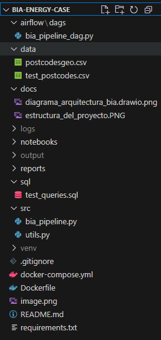

# Bia Energy - Caso Técnico

**Autor:** Jhonatan Andres Saldarriaga I.  
**GitHub:** [JhonatanS93-DE](https://github.com/JhonatanS93-DE)

Este repositorio contiene la solución del caso técnico en Bia Energy. Se desarrolla un pipeline modular para ingestión, enriquecimiento, almacenamiento y generación de reportes sobre datos geoespaciales.

---

## Objetivo del Proyecto

Desarrollar una solución de punta a punta para enriquecer coordenadas geoespaciales (`latitude`, `longitude`) usando la API de [postcodes.io](https://postcodes.io), transformarlas en códigos postales, integrarlas a una base de datos PostgreSQL, y generar reportes optimizados que permitan análisis rápidos y control de calidad de datos.

---

## Tecnologías y herramientas utilizadas

- **Python 3.10**
- **Docker + Docker Compose**
- **PostgreSQL 14**
- **Pandas, Requests, SQLAlchemy**
- **Postcodes.io API**
- **Git y GitHub**

---

## Estructura del Proyecto

La siguiente imagen resume la estructura principal del proyecto.




---

## Diagrama de Arquitectura

El siguiente diagrama muestra el flujo de datos completo del pipeline:More actions

[Ver diagrama editable en draw.io](docs/diagrama_arquitectura_bia.drawio.png)

Puedes abrirlo desde [https://app.diagrams.net](https://app.diagrams.net) arrastrando el archivo aqui se podria editar una mejora futura.

**Componentes de la arquitectura:**
- Ingesta de datos desde archivo CSV
- Enriquecimiento de coordenadas usando API pública `postcodes.io`
- Almacenamiento en base de datos PostgreSQL
- Generación de reportes automáticos
- Pipeline orquestado con Apache Airflow para entornos productivos

---

## Ejecución del Proyecto (Local con Docker)

### 1. Clona el repositorio

```bash
git clone https://github.com/JhonatanS93-DE/bia-energy-case.git
cd bia-energy-case
```

### 2. Agrega el archivo `postcodes_geo.csv` a la carpeta `data/`

### 3. Ejecuta el pipeline con Docker

```bash
docker-compose up --build
```

---

## Flujo de Datos

1. **Ingesta**: se toma un archivo `CSV` con columnas `latitude` y `longitude`.
2. **Enriquecimiento**:  
   - Se usa el endpoint *Bulk Reverse Geocode* de `postcodes.io`.
   - Envío en lotes (chunks de 100) para eficiencia.
   - Control de errores y validaciones.
3. **Almacenamiento**:  
   - Los datos enriquecidos se almacenan en PostgreSQL en la tabla `enriched_postcodes`.
4. **Reportes**:
   - `top_postcodes.csv`: códigos postales más frecuentes.
   - `quality_stats.csv`: porcentaje de coordenadas no enriquecidas.

---

## Logging centralizado

Sistema de logging implementado en `src/utils.py`:

```
2024-06-09 12:00:00 - INFO - Archivo CSV cargado con 1000 filas
2024-06-09 12:01:02 - ERROR - Fallo en la petición a la API: Timeout
```

Permite trazabilidad y monitoreo del pipeline en ambientes reales.

---

## Escalabilidad y Airflow

Se incluye una carpeta adicional `airflow/` con un DAG de Apache Airflow como implementación alternativa para entornos productivos:

- Orquestación modular del pipeline
- Programación periódica
- Reintentos automáticos ante errores
- Escalabilidad futura

Mejora adicional:  
- Incorporar caché para evitar peticiones repetidas  
- Agregar `pytest` para pruebas unitarias

---

## Explicacion final

Este proyecto refleja prácticas modernas de ingeniería de datos:
- Pipelines robustos y modulares
- Buenas prácticas de logging y errores
- Estructura productiva y escalable
- Listo para ser desplegado y operado en ambientes reales

---

Contacto: **jhonatan1393@gmail.com**  
También puedes dejar comentarios en el repositorio de GitHub.

---